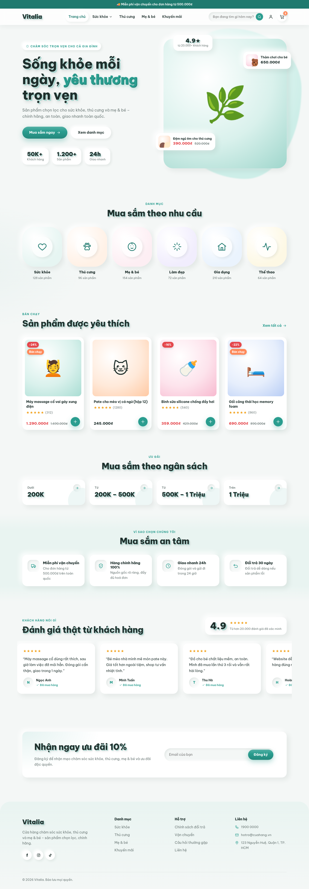

# Vitalia – Shopify theme bán hàng tổng hợp

Theme Shopify (Online Store 2.0) dành cho cửa hàng tổng hợp **sức khỏe · thú cưng · mẹ & bé · làm đẹp · gia dụng**.
Phong cách hiện đại, **nền sáng**, khối nổi mềm (soft UI) và **chữ nổi 3D** cho tiêu đề. Lấy cảm hứng bố cục từ wellivu.com.



## Tính năng

- Trang chủ kéo thả hoàn toàn trong trình chỉnh sửa theme, gồm các section:
  - Thanh thông báo chạy luân phiên
  - Banner chính (Hero) với tiêu đề chữ nổi, 2 thẻ sản phẩm nổi bật, huy hiệu đánh giá và các chỉ số
  - Danh mục nổi bật (icon hoặc ảnh, màu ô tuỳ chỉnh)
  - Sản phẩm nổi bật / Sản phẩm mới (nút thêm nhanh vào giỏ)
  - Mua theo mức giá (dưới 200K, 200K–500K…)
  - Cam kết / Lý do chọn (miễn phí vận chuyển, chính hãng, giao nhanh, đổi trả)
  - Hình ảnh kèm nội dung (câu chuyện thương hiệu)
  - Đánh giá khách hàng (slider)
  - Đăng ký nhận tin
- Trang sản phẩm: thư viện ảnh, chọn phân loại dạng nút, số lượng, thêm giỏ bằng AJAX, nút mua nhanh, cam kết, mục thu gọn, sản phẩm liên quan
- Trang danh mục: bộ lọc (Search & Discovery), sắp xếp, phân trang
- Giỏ hàng: thanh tiến trình miễn phí vận chuyển, tự cập nhật số lượng, ghi chú đơn hàng
- Đầy đủ trang tìm kiếm, blog, bài viết, trang nội dung, 404, mật khẩu, thẻ quà tặng, tài khoản khách hàng
- Giao diện tiếng Việt (`locales/vi.default.json`), font Google hỗ trợ tiếng Việt (mặc định *Be Vietnam Pro*)
- Responsive cho điện thoại, hỗ trợ giảm chuyển động (prefers-reduced-motion)
- Hiển thị sao đánh giá tự động nếu app đánh giá ghi vào metafield chuẩn `reviews.rating`

## Cài đặt lên Shopify

### Cách 1 – Tải file zip

1. Nén **nội dung** thư mục `shopify-theme` (các thư mục `assets`, `config`, `layout`, `locales`, `sections`, `snippets`, `templates` phải nằm ở gốc file zip; không cần thư mục `preview`):
   ```bash
   cd shopify-theme
   zip -r ../vitalia-theme.zip assets config layout locales sections snippets templates
   ```
2. Vào **Shopify Admin → Cửa hàng trực tuyến → Chủ đề → Thêm chủ đề → Tải tệp zip lên**.
3. Bấm **Tùy chỉnh** để chỉnh sửa, sau đó **Xuất bản**.

### Cách 2 – Shopify CLI

```bash
npm install -g @shopify/cli
cd shopify-theme
shopify theme dev --store ten-cua-hang.myshopify.com   # xem trước trực tiếp
shopify theme push --unpublished                      # đẩy lên cửa hàng
```

## Thiết lập sau khi cài

1. **Menu**: tạo menu `main-menu` (đầu trang) và `footer` (chân trang) trong *Cửa hàng trực tuyến → Điều hướng*. Menu con sẽ hiện dạng dropdown.
2. **Danh mục trang chủ**: trong section *Danh mục nổi bật*, chọn bộ sưu tập cho từng ô (Sức khỏe, Thú cưng, Mẹ & bé…).
3. **Sản phẩm nổi bật**: chọn bộ sưu tập cho section *Sản phẩm được yêu thích* và *Sản phẩm mới*.
4. **Banner chính**: tải ảnh nền sáng (khuyên dùng ảnh vuông ≥ 1200px) và chọn 2 sản phẩm nổi bật.
5. **Mua theo mức giá**: cần cài app *Shopify Search & Discovery* và bật bộ lọc *Giá* để liên kết `?filter.v.price...` hoạt động.
6. **Nhãn "Bán chạy"**: thêm tag `bestseller` hoặc `ban-chay` cho sản phẩm.
7. **Mạng xã hội, màu sắc, font, hiệu ứng chữ**: trong *Cài đặt theme*.

## Tuỳ chỉnh giao diện

Trong **Cài đặt theme**:

| Nhóm | Tuỳ chọn |
|---|---|
| Màu sắc | Nền trang, nền thẻ, màu chủ đạo, màu nhấn, nhãn giảm giá, sao đánh giá |
| Kiểu chữ | Font tiêu đề / nội dung (tên font Google), **hiệu ứng chữ: Nổi 3D · Nổi nhẹ (dập nổi) · Không** |
| Bố cục | Chiều rộng trang, độ bo góc, kiểu nút (bo tròn / bo góc) |

Có sẵn 3 bộ màu: **Mặc định (xanh ngọc)**, **Thú cưng (cam)**, **Mẹ & Bé (hồng)**.

## Cấu trúc

```
shopify-theme/
├── assets/      base.css (toàn bộ giao diện), theme.js (giỏ AJAX, biến thể, slider…)
├── config/      settings_schema.json, settings_data.json
├── layout/      theme.liquid, password.liquid
├── locales/     vi.default.json
├── sections/    các section (hero, category-list, featured-collection, …)
├── snippets/    product-card, price, icon, rating-stars, …
├── templates/   JSON templates + customers/
└── preview/     trang HTML tĩnh và ảnh xem trước (không cần tải lên Shopify)
```

Mở `preview/index.html` trong trình duyệt để xem nhanh trang chủ mà không cần Shopify.
